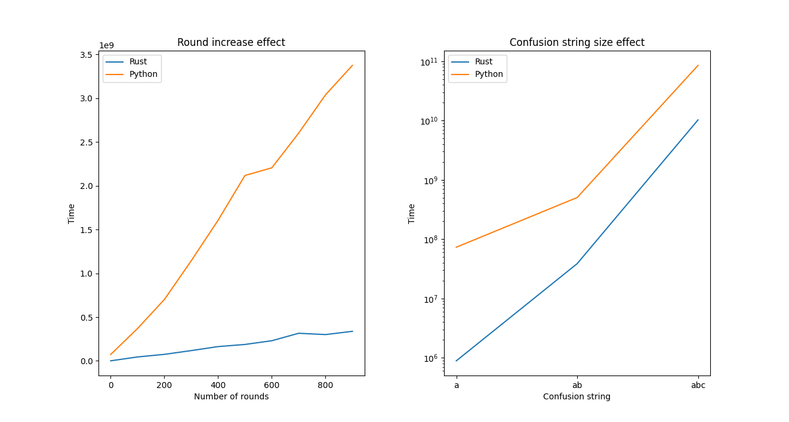

<!--
 Copyright 2023 David Araújo
 
 Licensed under the Apache License, Version 2.0 (the "License");
 you may not use this file except in compliance with the License.
 You may obtain a copy of the License at
 
     http://www.apache.org/licenses/LICENSE-2.0
 
 Unless required by applicable law or agreed to in writing, software
 distributed under the License is distributed on an "AS IS" BASIS,
 WITHOUT WARRANTIES OR CONDITIONS OF ANY KIND, either express or implied.
 See the License for the specific language governing permissions and
 limitations under the License.
-->

# Deterministic RSA key generation (D-RSA)

## Scope

This project was developed for the course of _Applied Cryptography_ at the University of Aveiro.

December 2023.

### Author

- [93444 &emsp; David Araújo](https://davidjosearaujo.github.io)

## Technologies used

For this projects, the two languages selected where **Rust** and **Python**.

Rust is an ideal choice for processing large numbers in RSA key generation due to its focus on **performance and safety**. Rust strikes a balance between high-performance requirements and robustness, making it well-suited for implementing the intricate calculations involved in RSA key generation.

Python's simplicity is key. Its clean syntax and high-level abstractions simplify complex calculations, facilitating quick and readable implementation. While not the fastest, Python's straightforward approach makes it an accessible and efficient choice for cryptographic tasks, emphasizing simplicity and ease of development.

## Pseudo-random generator

For this explanation, we will focus on the Rust implementation, as it is more complex to understand from the source code. Keep in mind that the Python implementation closely follows the same functions, variable names, and overall structure, so understanding the Rust implementation is translatable to Python.

The first step is to generate an initial seed of _N_-bytes. This is accomplished by using PBKDF2 with the **password as key** and the **SHA256 hash of the confusion string as salt**. The seed is then truncated to a length of _N_-bytes.

```rust
let mut sha256 = Sha256::new();
sha256.update(confusion_string);

// Adjust the size of the seed array based on the desired seed length
let mut seed = vec![0_u8; seed_length];
pbkdf2_hmac::<Sha256>(
    password.as_bytes(),
    &sha256.clone().finalize(),
    rounds,
    &mut seed,
);
```

To create the confusion pattern, we simply use the SHA256 **hash of the confusion string and truncate it to the size of the original string**.

```rust
// Create confusion pattern base on confusion string
let confusion_pattern = &sha256.clone().finalize()[..confusion_string.len()];
```

To generate the complex seed, the application employs the **RC4 stream cipher** engine.

RC4 is often chosen as the basis for a pseudo-random number generator due to its straightforward design and stream cipher architecture. It is essential to note that RC4 is not recommended for secure communications, and for cryptographic applications, more modern and secure PRNG algorithms are preferable to ensure robust protection against potential vulnerabilities and exploits.

This engine is initialized with the first calculated seed, and then it **recursively generates a stream from the previously generated stream**. This process continues until the generated stream **contains the confusion pattern**. The application repeats this for the number of rounds specified by the user.

```rust
fn complex_seed_generator(seed: &[u8], confusion_pattern: &[u8], rounds: u32) -> Vec<u8> {
    let mut buffer = seed.to_vec();
    let mut seedx = seed.to_vec();

    for _n in 0..rounds {
        let key = Key::<U32>::from_slice(&seedx);
        let mut rc4 = Rc4::<_>::new(key);
        loop {
            rc4.apply_keystream(&mut buffer);
            if contains(&buffer, confusion_pattern) {
                seedx = buffer.clone();
                break;
            }
            
        }
        
    }

    seedx.to_vec()
}
```

The application can now use this complex seed to generate the requested number of pseudo-random bytes. Once again, it utilizes the RC4 stream cipher engine, initialized with the complex seed. Subsequently, it initializes an array (_buffer_) of the desired size, filled with the value 0. This array is then passed through the RC4 engine, which generates the pseudo-random bytes.

<div style="page-break-after: always;"></div>

```rust
// Compute the requested number on random bytes using the complex seed
let key = Key::<U32>::from_slice(&complex_seed);
let mut rc4 = Rc4::<_>::new(key);
let mut buffer = vec![0_u8; byte_amount];
rc4.apply_keystream(&mut buffer);
```

## RSA key pair generator

The application receives input from stdin, which can come from any source of random data, but it only accepts it as a string in hexadecimal format. Input can be obtained from `urandom`, `openssl`, or the developed random number generator using the following examples:

```bash
hexdump -vn256 -e'"%08X"' /dev/urandom | ./d_rsa
```

```bash
openssl rand -hex 256 | ./d_rsa
```

```bash
./random_generator password cf 100 32 256 | ./d_rsa
```

In both applications, the received stream is read from stdin, and it is expected to be in hexadecimal format. The code then converts the hexadecimal string into an array of bytes:

```rust
let mut received_stream = String::new();
let _ = io::stdin().read_line(&mut received_stream).unwrap();

// Cast hex string into array of bytes
let random_bytes = hex::decode(received_stream.trim()).unwrap();
```

From the received bytes, the application uses half of the stream as the value for p and the other half for the value of q. For a **RSA key of 2048 bits, one must obtain 256 bytes from the number generator**.

```rust
// Split the array in half for p and q variables
let (p, q) = random_bytes.split_at(random_bytes.len() / 2);
```

The values of _p_ and _q_ must then be converted to prime numbers. This is achieved by first ensuring that the values are odd (if not already), and then using the _Miller-Rabin_ primality test to check if each value is prime. If a value is not prime, it will be incremented by 2 until it passes the primality test.

<div style="page-break-after: always;"></div>

```rust
fn turn_prime(number: &mut Vec<u8>) -> BigUint {
    // Turn prime
    //  1. LSB to 1
    //  2. Add 2 until it passes primality tests

    // Bitwise OR turns the LSB to 1
    let len = number.len();
    number[len - 1] |= 0b00000001;

    // Turn vector into a Big Unsigned Number
    let mut big_number = BigUint::from_radix_be(number, 256).unwrap();

    // Increase the number until a prime number is found
    loop {
        // Uses the Miller-Rabin primality test algorithm
        if is_prime(&big_number.to_string()) {
            break;
        }
        big_number += 2u32;
    }

    big_number
}
```

For the exponent value, the application simply uses the value of **65537**. With this value and having the big primes _p_ and _q_, the application can create an RSA private key, and from it, a public one.

```rust
let sk = RsaPrivateKey::from_p_q(big_prime_p, big_prime_q, e.clone()).unwrap();
let pk = sk.to_public_key();
```

After validating the key, the application exports the keys to **PEM formatted key files**.

```rust
// Verify validity
if sk.validate().unwrap() == () {
    let sk_path = Path::new("./rust.pem");
    let pk_path = Path::new("./rust.pub");
    let _ = sk.write_pkcs8_pem_file(sk_path, LineEnding::default());
    let _ = pk.write_public_key_pem_file(pk_path, LineEnding::default());
}
```

<div style="page-break-after: always;"></div>

## rsagen and randgen

### randgen

This Python script is designed for benchmarking and comparing the performance of the random number generator. The primary focus lies in two aspects: the **impact of the number of rounds** and the **size of the confusion string** on the execution time of the generator. In the speed testing section, the script runs the Rust and Python implementations with varying numbers of rounds and confusion string sizes, measuring the execution time for each configuration. Additionally, the script includes an option to print the generated random streams to stdout. This is the graph produced.

<p align="center">
  
</p>

As we can see, the increase in number of rounds as a drastic effect in the efficiency of the Python implementation. But although Python remains slower than Rust across both scenarios, the difference is consistent when regarding the increase in the size of the confusion string.

From this tests, it is clear that the size of the confusion string as a profound impact on the performance, and that is way the test only uses string with less than 3 characters, as when provided with strings larger that that, neither version as capable of dealing resulting in a reasonable amount of time.

For both tests, apart from the the the parameters stayed consistent, only changing the necessary ones for each test. The parameters were defined as follows:

- password: "password"
- confusion string: "cf" (except for the confusion string test)
- rounds: 100 (except for the rounds test)
- seed length: 32
- byte amount: 256

<div style="page-break-after: always;"></div>

Before executing, the script ensures the compilation of Rust binaries by invoking `cargo build`.

Here are the options for running `randgen.py`.

```bash
user@debian$ python3 randgen.py -h
usage: randgen.py [OPTION]

options:
  -h, --help    show this help message and exit
  -s, --speed   generate Python vs. Rust speed test graphs
  -o, --stdout  print to stdout the random stream generated
```

### rsagen

This Python script facilitates the generation of RSA key pairs using either a Rust or Python implementation based on user preferences specified through command-line arguments.

The user inputs a random stream, and the script then triggers the chosen RSA key generation process (Rust or Python), or this input can be _piped_ into the application. The resulting key files are then created by the applications.

Here are the options for running `rsagen.py`.

```bash
user@debian$ python3 rsagen.py -h
usage: hexdump -vn256 -e'"%08X"' /dev/urandom | python3 rsagen.py [OPTION]

options:
  -h, --help     show this help message and exit
  -rs, --rust    Rust RSA key generator
  -py, --python  Python RSA key generator
```

## Difficulties in implementation in seconds language

During the project, a significant challenge arose when trying to confirm the correct generation of the prime numbers used in RSA keys, especially the large ones. Verifying that these primes met the necessary cryptographic standards for security and randomness was complex and required careful examination and validation.

Despite putting in a lot of effort into both the Rust and Python implementations, it's important to note that, under the same conditions (parameters and input bytes), the two applications **didn't consistently produce identical RSA key pairs**. This inconsistency raises questions about how the algorithms in the two implementations work and emphasizes the complexities of achieving consistent results across different programming languages. It underscores the need for thorough testing and validation in cryptographic applications to make sure that the generated key pairs are reliable and consistent.