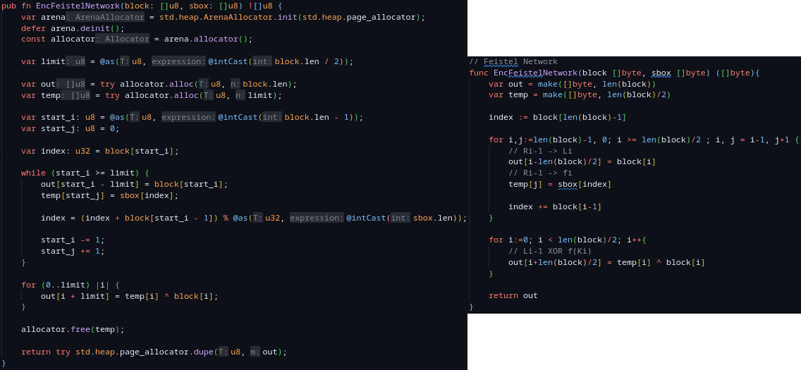
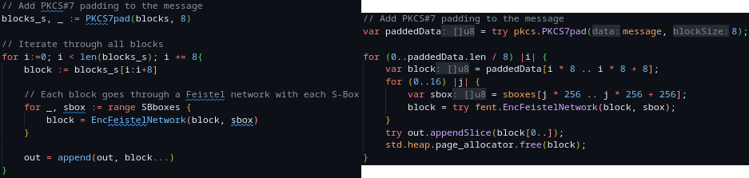

<!--
 Copyright 2023 davidjosearaujo
 
 Licensed under the Apache License, Version 2.0 (the "License");
 you may not use this file except in compliance with the License.
 You may obtain a copy of the License at
 
     http://www.apache.org/licenses/LICENSE-2.0
 
 Unless required by applicable law or agreed to in writing, software
 distributed under the License is distributed on an "AS IS" BASIS,
 WITHOUT WARRANTIES OR CONDITIONS OF ANY KIND, either express or implied.
 See the License for the specific language governing permissions and
 limitations under the License.
-->

# 1st Project - Enhanced DES (E-DES)

### Author

- [David Araújo - 93444](http://davidjosearaujo.github.io/)

# Motivation and objectives

The task at hand involves the implementation of a DES variant known as E-DES. Historically, traditional DES had notable shortcomings, particularly in its employment of S-boxes. Notably, the S-boxes in DES were both fixed and publicly known, essentially exposing the transformation applied by each S-box, thereby facilitating attackers in devising their strategies. 

Moreover, DES's reliance on a 56-bit key length is currently deemed inadequate in the context of contemporary security standards. With the rapid advancements in computing power, a brute-force attack on DES can now be executed with relative swiftness, underscoring the urgency of employing more robust encryption methods.

To address these critical weaknesses, the E-DES will possess the following capabilities:
- Utilize a **256-bit** key, derived from a user provided password.
- Derive the S-boxes from the key, instead of using fixed and known S-boxes.

## Technologies implemented

This project demanded the development of similar modules and applications in two distinct programming languages to enable subsequent performance comparisons and validate the algorithm's consistency across different platforms.

The two languages chosen were **Zig**, a system programming language that places a strong emphasis on performance by offering fine-grained control over memory management, a rich set of low-level features, and a focus on safety and predictability in order to produce efficient and highly optimized code for a wide range of applications, from embedded systems to high-performance software, and **Go** a statically typed, compiled programming language that prioritizes performance by offering efficient concurrent execution through _goroutines_, a garbage collector designed for low-latency, and a rich standard library, enabling developers to build high-performance applications, particularly suited for scalable, concurrent, and networked software.

# E-DES and Substitution Boxes

The initial step in securely encrypting data involves deriving a robust 256-bit key from the user's password, ensuring a level of confusion and diffusion that thwarts unauthorized attempts to reproduce the key without knowledge of the original password.

To generate this key, we employ a straightforward method—calculating the hash of the password using the **SHA-256** digest function. However, for added security, this key isn't used directly for encryption. Instead, it serves as the data to be encrypted using **ChaCha20X-Poly1305**, a stream cipher recognized for its remarkable efficiency and resilience against a spectrum of cryptographic attacks. This process results in the creation of a 128-bit shuffling key, which will subsequently be used to rearrange the S-boxes further enhancing the encryption's security.

    

## Why is shuffling necessary ?

For correct generation of the S-boxes, these must follow some rules, such as:

- Being deterministically computed.
- Every value must repeat it self exactly 16 times across all the boxes.

The most efficient method for creating these boxes is to generate a sequential list of 4096 values, ranging from 0 to 256 (0x00 to 0xff), with each value repeating itself 16 times. Subsequently, this list can be effectively shuffled through a derivation function associated with the encryption key.

In this project, I introduced a concept I referred to as the **_Rubik Shuffling_**. The idea involves treating a list of 4096 elements as a 64 by 64 square matrix. Using a 128-bit shuffling key, where all values are subject to a modulus of 64, half of this key is employed to determine offsets for rotating the columns, while the other half determines offsets for rotating the rows. This technique essentially reorders the elements within the matrix using these calculated offsets, resulting in the Rubik Shuffling process.

    

# Feistel Networks in encryption and decryption

## Feistel Networks

In the encryption process itself, much like DES, E-DES employs Feistel Networks. A Feistel Network represents a widely used symmetric-key block cipher construction in modern cryptographic algorithms. Its operation involves iteratively dividing the input block into two equal halves (4 bytes each in E-DES) referred to as the left and right sides. Subsequently, it applies a series of rounds where one half undergoes a transformation while the other half remains unaltered. This transformed half typically undergoes a complex function, which, in the case of E-DES, involves using the value of each byte as an index within the provided _S-box_ and substituting it with the value located at that index. This process iterates for a predetermined number of rounds (16, one for each _S-box_), ultimately culminating in the combination of the two halves to yield the final ciphertext.

    

## Encryption and decryption

This procedure is reiterated for each block of the original text. E-DES uses 8-byte blocks, necessitating padding before encryption. The final ciphertext is formed by concatenating all the independently encrypted blocks, following the adoption of the ECB mode.

    

The decryption process in E-DES mirrors the encryption process in reverse. Each block of the original ciphertext, which is the result of independently encrypting 8-byte blocks using the ECB mode, is subject to decryption. The independently decrypted blocks are then concatenated to reconstruct the original plaintext. The use of Feistel Networks ensures that the decryption process is a precise inverse of the encryption process, maintaining data integrity and security. The process involves taking each block of ciphertext, applying the reverse of the _S-box_ substitution, and reversing the order of subkeys in each round to recover the original data. Padding, if added during encryption, is also handled appropriately during decryption to ensure the complete and accurate retrieval of the original text.

    

# Testing and performance

## Build

First, in order to test these application, since they are both written in compiled programming languages, we must compile the source code into the respective binaries. This can be done in Go and Zig as follows.

    

    

As we can see, both can be use as CLI applications to encrypt and decrypt simple text messages.

## Test

For testing, timestamps are measured right after the _S-box_ creation and after the encryption/decryption of a message, in order to isolate the time it takes for the encryption/decryption process.

This was done for both application, and these were also compared with a standard DES implementation, which performed encryption over messages of equal size.

    

DES has a performance advantage over E-DES of approximately 28% in encryption and 14.5 times in decryption. This means that DES can encrypt or decrypt data about 28% faster than E-DES.

Significantly, to confirm that both applications indeed adhere to the same algorithm, it's noteworthy that content can be seamlessly encrypted and decrypted interchangeably between the two.

    

## Performance

Overall, the E-DES, as it is implemented, is still far behind in performance when compared with DES implementations.

Improving memory allocation in both Zig and Go can significantly enhance the overall performance of the encryption process. In Zig, it's advisable to consider manual memory management, allowing it to have more precise control over memory allocation and deallocation. While Zig provides strong memory safety guarantees, manual memory management can sometimes lead to better performance, especially in scenarios where it needs to minimize memory overhead and allocate memory more efficiently. By directly managing memory, it can avoid unnecessary overhead associated with automatic memory management and achieve better performance in terms of both speed and resource utilization.

In Go, optimizing memory allocation for performance can be approached by minimizing the use of unnecessary memory allocations, particularly in encryption loops. Go's garbage collector can introduce non-deterministic delays, affecting the predictability and speed of the encryption process. Reusing memory buffers where possible and utilizing techniques like sync.Pool to recycle memory, reducing the frequency of memory allocation and deallocation. By reducing memory churn and ensuring efficient memory usage, the encryption process in Go can be optimized. Additionally, Go's runtime and profiling tools can be valuable for identifying memory allocation bottlenecks and optimizing the code further.

Using more pointers instead of frequent memory allocations can lead to significant performance benefits. Pointers reduce memory overhead by eliminating the need for memory allocation structures, resulting in more efficient memory usage. They also improve data locality, which enhances cache utilization and speeds up memory access times. This is particularly true when it comes to the Zig implementation.

### Limitations and shortcomings

In the context of Zig, as previously mentioned, the adoption of manual memory allocation and the extensive use of pointers can bring about notable efficiency and performance improvements. However, this approach does carry the risk of introducing errors stemming from programmer oversight. This particular aspect becomes evident in Zig's performance testing, where the system falls short of meeting the prescribed parameters. Specifically, when attempting to execute 100,000 consecutive encryption and decryption operations, it triggers memory management errors. This occurrence is likely attributed to an aspect of the program's design that may not be optimally performance-oriented rather than an inherent limitation of the technology itself.

