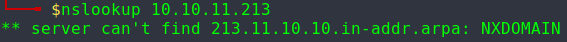

# Executive Summary

Discovered an SQL injection vulnerability on the login page of www.example.com, potentially revealing user password hashes.

# Detailed Description

The login form on www.example.com does not seem to sanitize user input properly, leaving it vulnerable to SQL injection attacks. An attacker could potentially access user password hashes or other sensitive data stored in the database.

# Tools and Environment

The vulnerability was found using a MacBook Pro running macOS Big Sur Version 11.4, using the Google Chrome browser Version 92.0.4515.131. The SQLmap tool was used to identify the vulnerability.

# Format Machine

## Steps to Reproduce

### 1. Port mapping

Begin by using `nmap` to map the machine open ports. When doing you will find that the machine exposes three ports.

### 2. Visit addresses

By running `curl` to the same address, we can see that a **domain** called _microblog_ and a subdomain called  _app_ are expected.

Know this, you can add to these entries `/etc/hosts` since running `nslookup` results in no external server being able to resolve the hostname to this IP address.

### 3. Visiting domains

#### 3.1 [http://microblog.htb:3000](http://microblog.htb:3000)

Visiting this domain you discover an exposed self-hosted Git repository.

Exploring this you can discover a repository which appears to contain the code for an website.

#### 3.1.1 Swagger API

You will also find that an API is exposed, with the bonus of having the documentation available. This could be exploited in order to gain access of the repository service.

### 3.2 [http://app.microblog.htb:80](http://app.microblog.htb:80)

You will now be able to visit the website that is described by the code in the previous repo.

#### 3.2.1 Spider

We will now run **OWASP ZAP** _spider_ in order to easily explore the website.

As you can see, there are various alerts raised by ZAP that should be addressed.

### Fuzzing domains

Since in the repository it seemed has there would be more that just this simple pages, it might be a good idea to fuzz the domain in search for other subdomains and paths that may not be visible. Sure enough, another subdomain is found, _sunny_.

After adding this subdomain to the hosts DNS resolution file, this is what you can find.

## Attack Surface Overview

For this machine the base attack surface should now be sufficient to carry out a deeper exploration. The most common approach would be to try and use BurpSuite and exploit the API by proxing the traffic and creating a test account and interact as much as possible with the application.

# Author

Surname, Firstname - email

