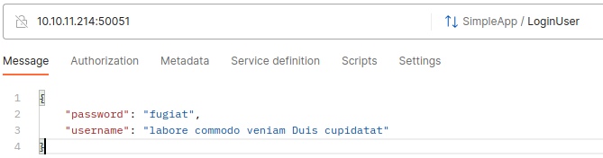
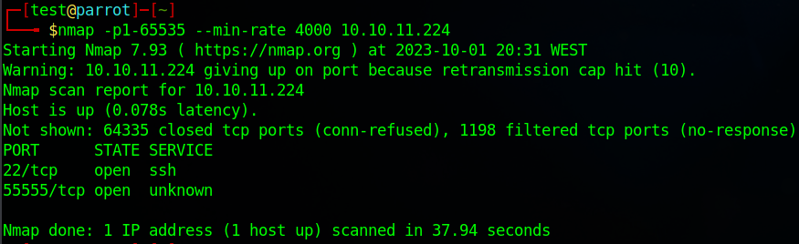

# Executive Summary

This report is intended to round up the information gathered and method utilized for enumeration of multiple machines.

In most machines there was sufficient information uncovered to, most likely, successfully exploit and _own_ the machine. Having said this, due to time constraints and the defined scope for this report, only enumeration and possible exploitation vector identification, were covered.

## Index
The following machines were explored:
- [Format](#format-machine)
- [PC](#pc-machine)
- [Jupiter](#jupiter-machine)
- [Pilgrimage](#pilgrimage-machine)
- [SAU](#sau-machine)
- [Authority](#authority-machine)
- [Gofer](#pc-machine)
- [CozyHosting](#cozyhosting-machine)
- [Clicker](#clicker-machine)

# Tools and Environment

- Nmap
- Amass
- OWASP ZAP
- gobuster
- dirsearch
- wfuzz
- Postman
- BurpSuite

# Format Machine

## Steps to Reproduce

### 1. Port Mapping

Begin by using `nmap` to map the machine open ports. When doing you will find that the machine exposes three ports.

### 2. Visit addresses

By running `curl` to the same address, we can see that a **domain** called _microblog_ and a subdomain called  _app_ are expected.

Know this, you can add to these entries `/etc/hosts` since running `nslookup` results in no external server being able to resolve the hostname to this IP address.

### 3. Visiting domains

#### 3.1 [http://microblog.htb:3000](http://microblog.htb:3000)

Visiting this domain you discover an exposed self-hosted Git repository.

Exploring this you can discover a repository which appears to contain the code for an website.

#### 3.1.1 Swagger API

You will also find that an API is exposed, with the bonus of having the documentation available. This could be exploited in order to gain access of the repository service.

### 3.2 [http://app.microblog.htb:80](http://app.microblog.htb:80)

You will now be able to visit the website that is described by the code in the previous repo.

#### 3.2.1 Spider

We will now run **OWASP ZAP** _spider_ in order to easily explore the website.

As you can see, there are various alerts raised by ZAP that should be addressed.

### 3.3 Fuzzing domains

Since in the repository it seemed has there would be more that just this simple pages, it might be a good idea to fuzz the domain in search for other subdomains and paths that may not be visible. Sure enough, another subdomain is found, _sunny_.

After adding this subdomain to the hosts DNS resolution file, this is what you can find.

## Attack Surface Overview

For this machine the base attack surface should now be sufficient to carry out a deeper exploration. The most common approach would be to try and use BurpSuite and exploit the API by proxing the traffic and creating a test account and interact as much as possible with the application.

# PC Machine

## Steps to Reproduce

### 1. Port Mapping

Beginning with `nmap`, we can see that is at least does not respond to pings. But it show an open SSH port if run with the `-Pn` option.

However, as `nmap` reports, it only filtered 999 ports, it may be possible that there are other exposed ports in the entire gama of 65535 ports. To accommodate that we will specify the entire port range. This produces interesting results with another open port found.

### 2. Testing port 50051

When trying to run ´curl´ to this address and port, the output is return as in some form of binary. This is common when the connection is trying by crossing different protocols, and you can expect that whatever the connection protocol is, dos not support http.

By researching online, one can discover that **gRPC** usually uses port 50051 and this types of default port specification should always be considered for testing, and so we did.

Using Postman, you can try to make requests to this address. Postman offers some simple template for request paths, and you can use the _LoginUse_ with the example message also provided.

## Attack Surface Overview

From were, you should be able to further exploit by trying to brute-force the login request and advance.

# Jupiter Machine

## Steps to Reproduce

### 1. Port Mapping

Use nmap to search the complete range of ports.

Knowing a http service is available, you can visit the browse and add to `/etc/hosts` the domain that results from the address search

### 2. Web Application mapping

Using `ZAP` map the website to quickly _spider_ through it.

### 3. Fuzzing

#### Subdomain

One subdomain _kiosk_ is found, add it to the `/etc/hosts` to view it in the browser.

This will result in access to a Grafana dashboard.

## Attack Surface Overview

From were, you should be able to further exploit by exploring the data visible in the Grafana dashboard.

# Pilgrimage Machine

## Steps to Reproduce

### 1. Port Mapping

### 2. Website Exploration

We can see that the site allow to upload a file. This always a risky operation so it should be further explored.

For now, from simply inspecting the resources, you can discover that this web application is built using PHP.

### 3. Site map

Create a website map with ZAP, and you will be able to get an approximation of the layout.

### 4. Exposed git

When `dirsearch` is run, a `.git` path is found, and when trying to access it, it is possible to retrieve its contents!

## Attack Surface Overview

For here you should be able to find critical information about the repository, maybe even credentials.

Further exploring the paths, mainly those most common in PHP would also be relevant.

# SAU Machine

## Steps to Reproduce

### 1. Port Mapping

### 2. Website

### 3. Paths

Knowing baskets following are identified by the path, fuzzing the path may result in interesting finds. This appears to be a storage basket service, so usernames should be common. Unfortunately nothing is found.

## Attack Surface Overview

This type of request baskets can have multiple services depending on them, and it should be possible to gain access to the service with some known exploit that allows us to traverse the baskets.

# Authority Machine

## Steps to Reproduce

### 1. Port Mapping

As usual, use nmap to scan for ports, a gather as much information as possible.

A port 53 is open, you should run `nslookup`

### 2. SMB Mapping

Samba is quite an "_outdated_" mechanism for storage, and comes with flaws, so you should always enumerate samba share drives across an entire domain. List share drives, drive permissions, share contents, upload/download functionality, file name auto-download pattern matching, and maybe even execute remote commands.

## Attack Surface Overview

From this point, one should consider mounting the samba drive and further explore any exposed information, which can prove quite insightful.

# Gofer Machine

## Steps to Reproduce

### 1. Port Mapping

### 2. Website Exploration

Not much at first sight, seems like a simple One-Page Website.

### 3. Samba search

### 4. Domain and Path Fuzzing

Although no subdomains or relevant paths were discovered, there is still the assets folders for search.

## Attack Surface Overview

In this target, the surface does not seem as large as others, but the samba storage would still be the primary target to explore further.

# CozyHosting Machine

## Steps to Reproduce

### 1. Port Mapping

### 2. Website Exploring

This appeared during a `dirsearch` run, and errors should always be explored.

With a bit of online search, we can discover that this is a typical error of **SpringBoot**.

## Attack Surface Overview

Knowing that this is application running SpringBoot, you should now explore the known paths and exploits used for this framework.

# Clicker Machine

## Steps to Reproduce

### 1. Port Mapping

With `nmap` we are able to discover a website and a nfs service, which is handy since is is a shared storages service.

### 2. Website Exploration

Always a faster to _zap_ the website that manually discover since it is faster and allows for the exploration of the request format.

## Attack Surface Overview

After knowing these too surfaces, one should start by trying to mount the nfs directory and search for more clues.

Fuzzing and subdomain enumeration were also tried, but did not resolve any relevant information.

# Author

David José Araújo Ferreira, 93444 - [davidaraujo@ua.pt](mailto:davidaraujo@ua.pt)

Report submitted for the Lab 01 of _Analysis and Vulnerability Exploitation_ course at the University of Aveiro.