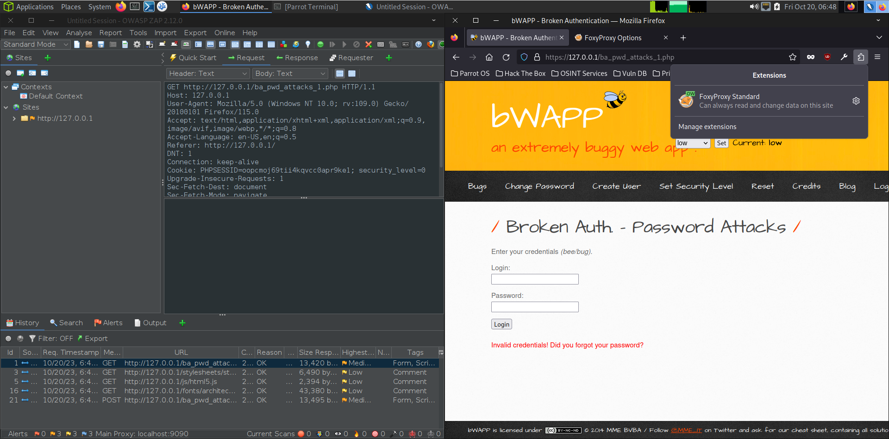
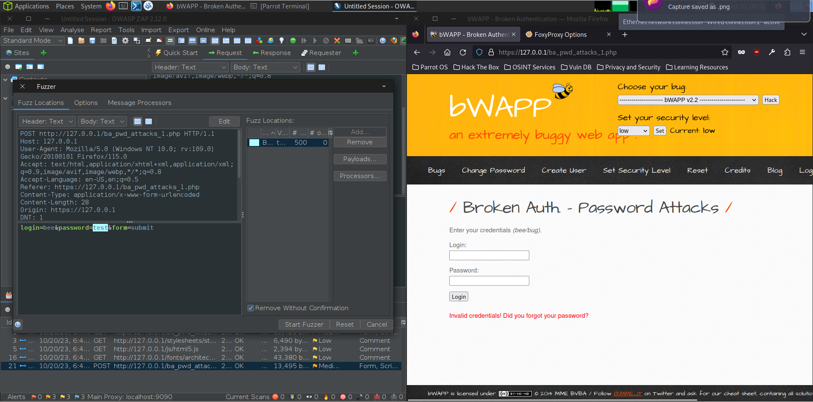
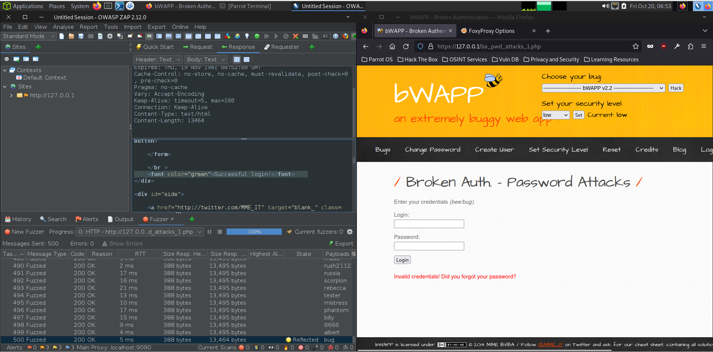

# Lab 03 - Broken authentication and XSS

## Scope

This assessment scope focused on two activities:

- **bWAPP** - bWAPP is a free and open-source deliberately insecure web application.
  - **Broken Auth - Password Attacks**
  - **Session Management - Cookies (HTTPOnly) Medium**
  - **Session Management - Session ID in URL**
- **HTB Toxic Challenge**

# bWAPP

## 1. Broken Auth - Password Attacks

This attack is quite simple, the only procedure occurring is a dictionary attack were we specify a list of word, and the ZAP application will rapidly execute request with every single word until it finds a successful response. 

## 2. Session Management - Cookies (HTTPOnly) Medium

## 3. Session Management - Session ID in URL 

# Toxic HTB Challenge 

In the downloaded files, we can see that eh “PHPSESSID” cookie value is base64 encoded and it’s content is displayed on the webpage.

Knowing this, we are able to visualize how the cookie is constructed by bas64 decoding it. This is useful because we can now test if the application accepts forged cookies and what type of access we are able to obtain.

To test for access and level of privilege, we try to access the linux password file, `etc/passwd`,  and we confirm that ,indeed, we have root access.  

From analyzing the network requests and the provided files, we also know that the server uses and nginx service. We can try to access the log file from this server by requesting it via a forged cookie.

What we learn from this is that the service reflects the `User-Agent` field into the log file, meaning that it is adding the contents of this field directly onto the PHP, without sanitization, which will probably allow us to inject PHP and OS commands.

This is exactly what we do. Firstly, we find out what theres is in the root folder, and we can clearly see that a `flag` file is present.

Opening this file reveals the flag that we were searching.

# Author

David José Araújo Ferreira, 93444 - [davidaraujo@ua.pt](mailto:davidaraujo@ua.pt)

Report submitted for the Lab 03 of _Analysis and Vulnerability Exploitation_ course at the University of Aveiro.
