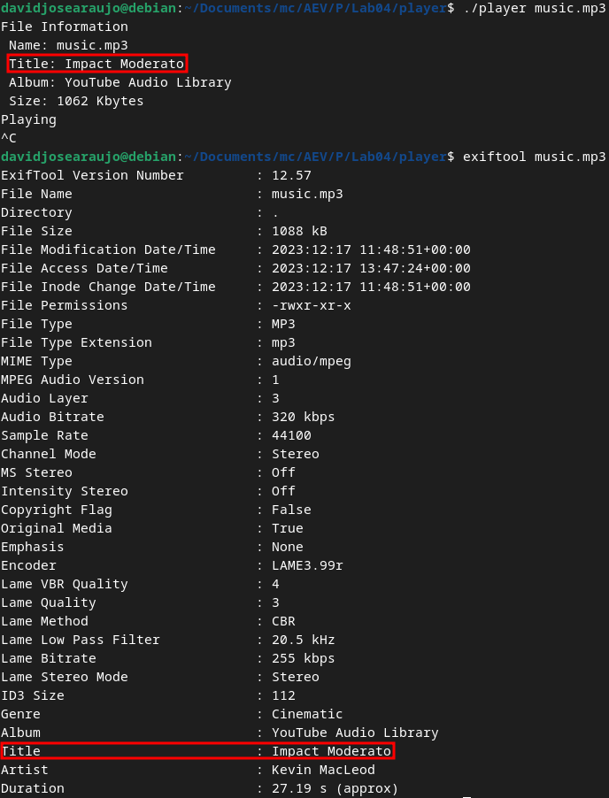
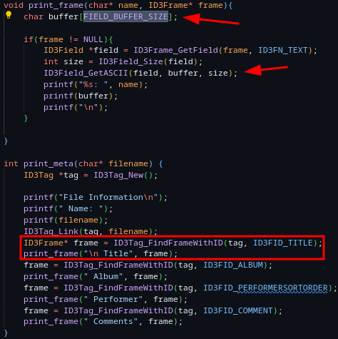
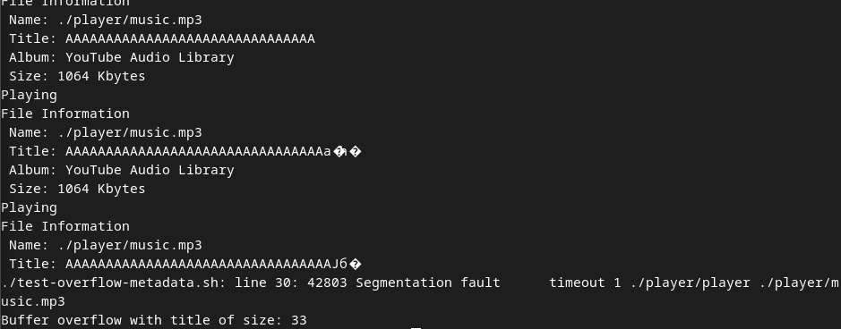
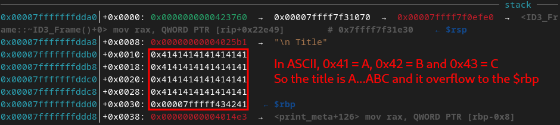

<!--
 Copyright 2023 David Araújo
 
 Licensed under the Apache License, Version 2.0 (the "License");
 you may not use this file except in compliance with the License.
 You may obtain a copy of the License at
 
     http://www.apache.org/licenses/LICENSE-2.0
 
 Unless required by applicable law or agreed to in writing, software
 distributed under the License is distributed on an "AS IS" BASIS,
 WITHOUT WARRANTIES OR CONDITIONS OF ANY KIND, either express or implied.
 See the License for the specific language governing permissions and
 limitations under the License.
-->

# Lab 04 - Buffer Overflow

## TryHackMe - Buffer Overflow Prep

## TryHackMe - Intro to Pwntools

## Player

By running `flawfinder` within the _player_ directory, after running the `make`command, the tool returns the following output.


From this we are able to identify five possible flaws within the _player.c_ code. Two of this flaws are considered as "buffer flaws" and described as: **statically-sized arrays can be improperly restricted, leading to potential overflows or other issues (CWE-119!/CWE-120)**.

```C
16  #define FIELD_BUFFER_SIZE 16
...
49  char buffer[FIELD_BUFFER_SIZE];
...
157 static char stream[1152 * 4];
```

In these lines, we can see that char streams and buffers are being allocated with fixed sized. This can be a problem in C because, depending on the way that input is being handled, it may **allow an user to introduce enough input to exceed the buffers capacity**, doing that may lead to the system to write this input to unpredicted spaces in the memory.

By analyzing the execution of the execution of the application, we are able to discover it prints the metadata of the audio files. We can then also use `exiftool` to expose all the metadata and see where are the field accessed by the application.



By then analyzing the code, we discover that one of the possible _buffer overflow_ flows is exposed and used to print the metadata field. It then stands to reason that, if one of the metadata field were to have a sufficiently large data string, it could possibly overflow the buffer. We can try this with the _Title_ field.



To test this, we created a simple _bash_ script that tries to run the music player with an increasingly large title. If the execution crashes, it outputs the title that has caused it.

```Bash
#!/bin/bash
TITLE="A"
while :
do
    timeout 1 ./player/player ./player/music.mp3
    # Check if timeout successful or execution crashed
    if [[ $? -ne 124 ]]
    then
        echo "Buffer overflow with title of size: ${#TITLE}"
        break
    fi
    # Increase title length
    TITLE="${TITLE}A"
    id3v2 --TIT2 "${TITLE}" player/music.mp3
done
```

This test proves successful and we get the following output.



We can do the exact same thing with increasingly large file names, has the function that prints it uses the same buffer flaw as in the metadata tags. We can then add the characters 'B' and 'C' to the end of the title to easily notice them.



<P style="page-break-before: always">

# Author

David José Araújo Ferreira, 93444 - [davidaraujo@ua.pt](mailto:davidaraujo@ua.pt)

Report submitted for the Lab 04 of _Analysis and Vulnerability Exploitation_ course at the University of Aveiro.
