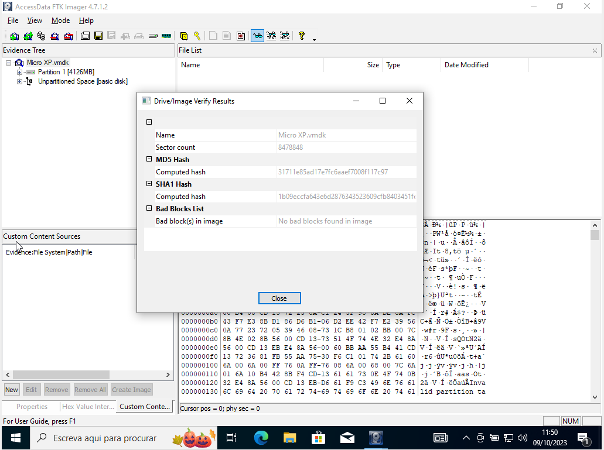
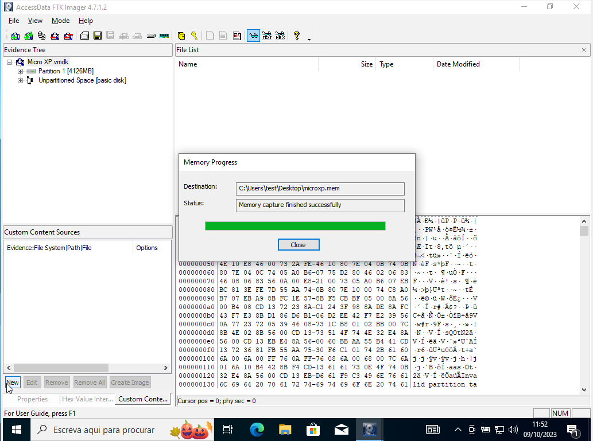
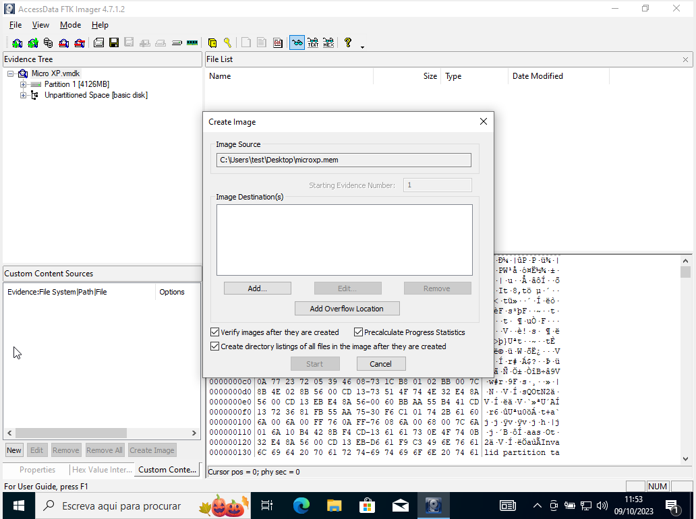
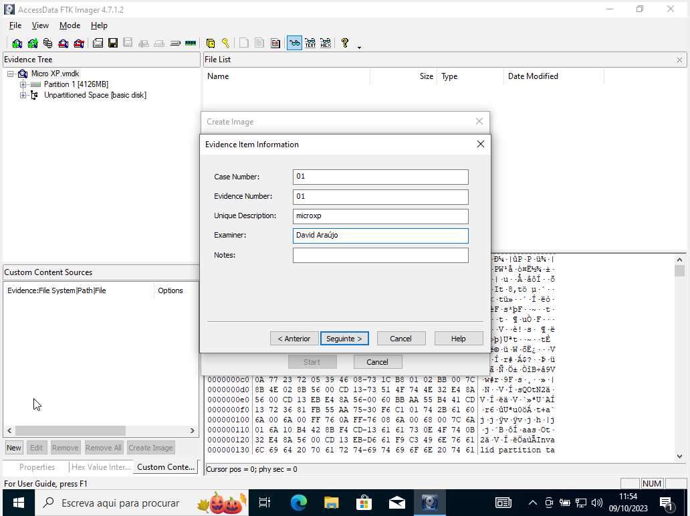
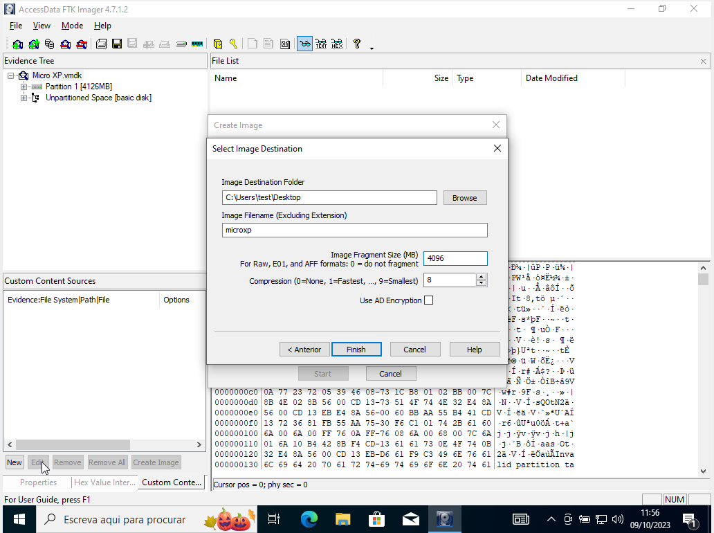
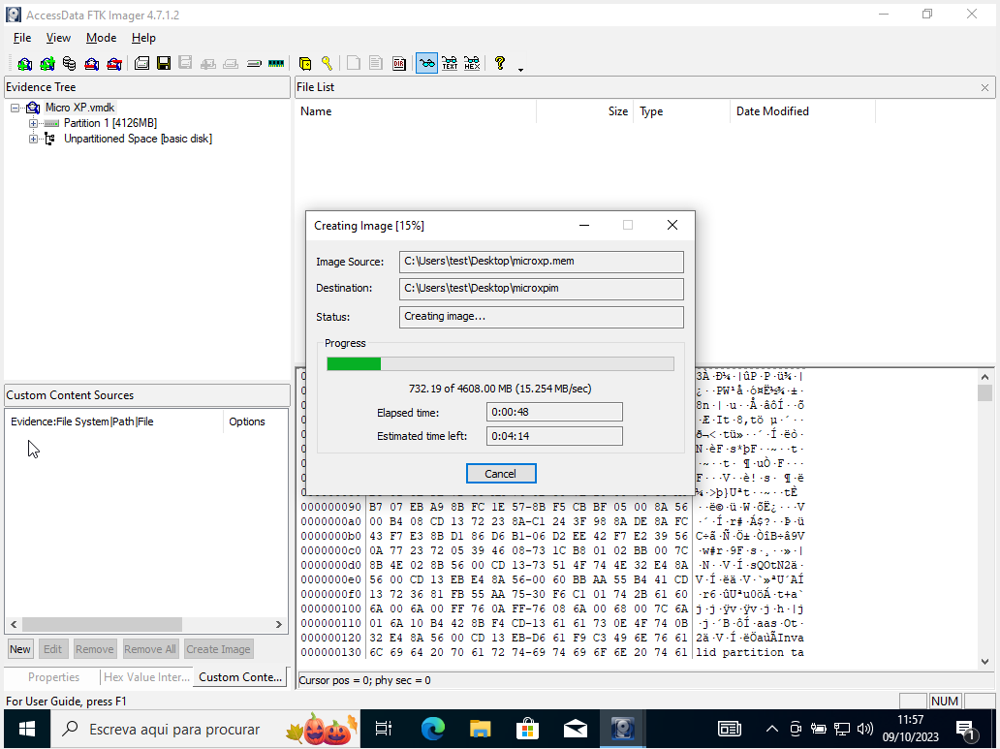
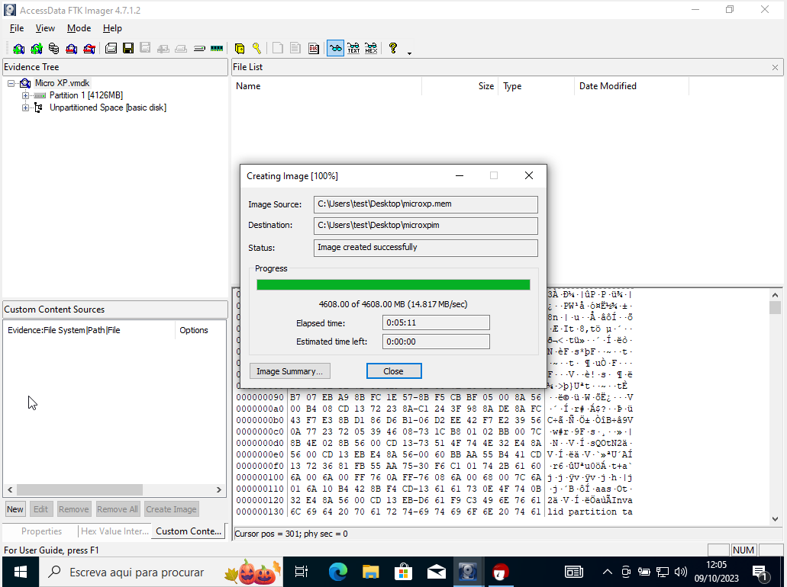
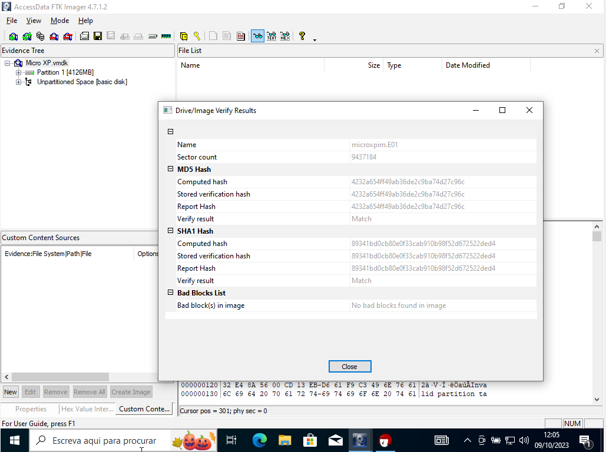

# Lab02

## Imaging

### Step to produce image

1. Verify image

2. Dump memory from the `vmdk` file

3. Create image options

4. For sake of compatibility, use E01

5. Identify the evidence and the Examiner

6. Partition the image in chunks of 4096MB with high compression

7. Verify the checksums of the produced image

### Sign the contents

Using GPG, we sign the `E01.txt` file that contains the description and checksums of the volumes.

## Hashing Analysis Experiments

Analysis of checksum collision in different files given.

### Example 02

| File name | Checksum | Hash Method |
| - | - | - |   
| shattered-1.pdf | ee4aa52b139d925f8d8884402b0a750c | MD5 |
| shattered-1.pdf | **38762cf7f55934b34d179ae6a4c80cadccbb7f0a** | SHA1 |
| shattered-1.pdf | 2bb787a73e37352f92383abe7e2902936d1059ad9f1ba6daaa9c1e58ee6970d0 | SHA256 |
| shattered-2.pdf | 5bd9d8cabc46041579a311230539b8d1 | MD5 |
| shattered-2.pdf | **38762cf7f55934b34d179ae6a4c80cadccbb7f0a** | SHA1 |
| shattered-2.pdf | d4488775d29bdef7993367d541064dbdda50d383f89f0aa13a6ff2e0894ba5ff | SHA256 |

## Example 03

| File name | Checksum | Hash Method |
| - | - | - |   
| plane.jpg | **253dd04e87492e4fc3471de5e776bc3d** | MD5 |
| plane.jpg | 780973c1c165e76de3f10e1771db31cf9362d1f5 | SHA1 |
| plane.jpg | 91e34644af1e6c36166e1a69d915d8ed5dbb43ffd62435e70059bc76a742daa6 | SHA256 |
| ship.jpg | **253dd04e87492e4fc3471de5e776bc3d** | MD5 |
| ship.jpg | 9639db1fbadfcfbd4025a9b95d10b7799f65fcfb | SHA1 |
| ship.jpg | caf110e4aebe1fe7acef6da946a2bac9d51edcd47a987e311599c7c1c92e3abd | SHA256 |

## Author

- David José Araújo Ferreira, 93444 - [davidaraujo@ua.pt](mailto:davidaraujo@ua.pt)