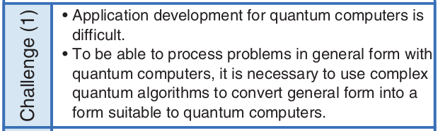
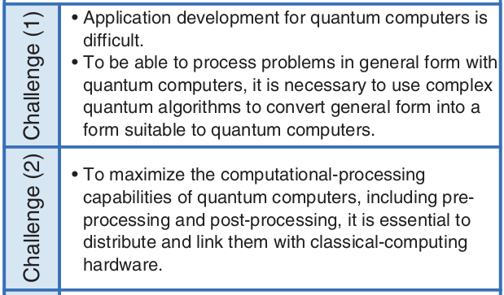
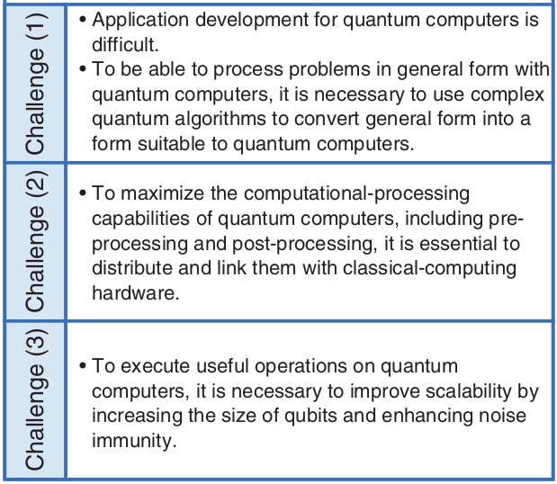
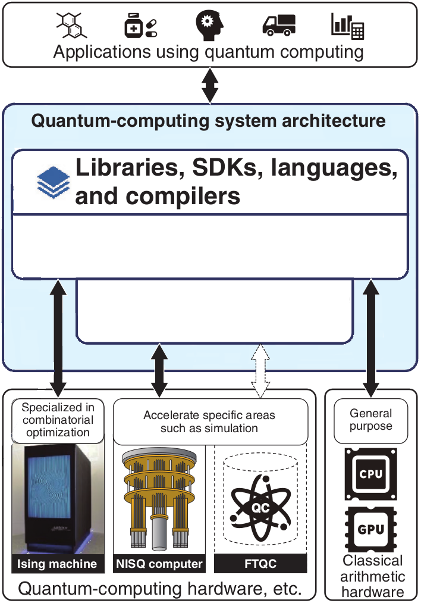
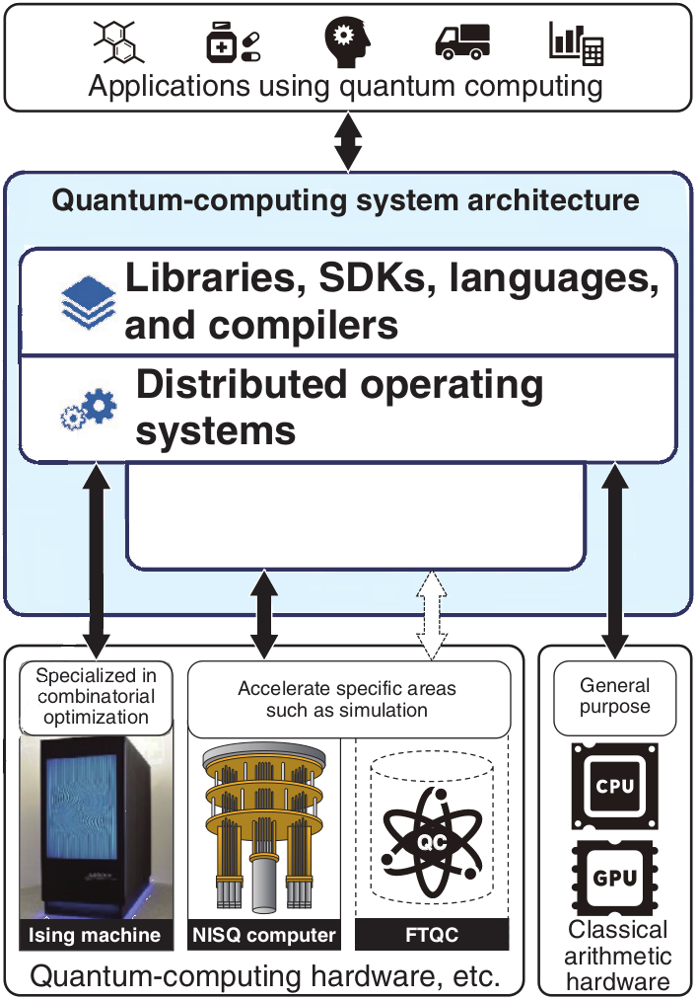
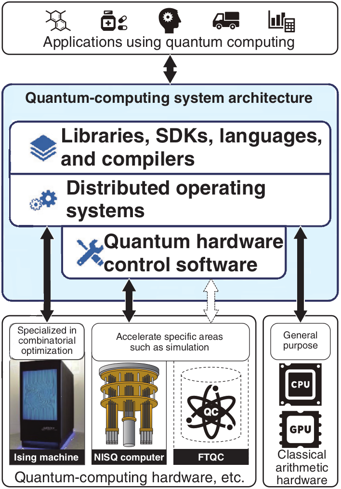
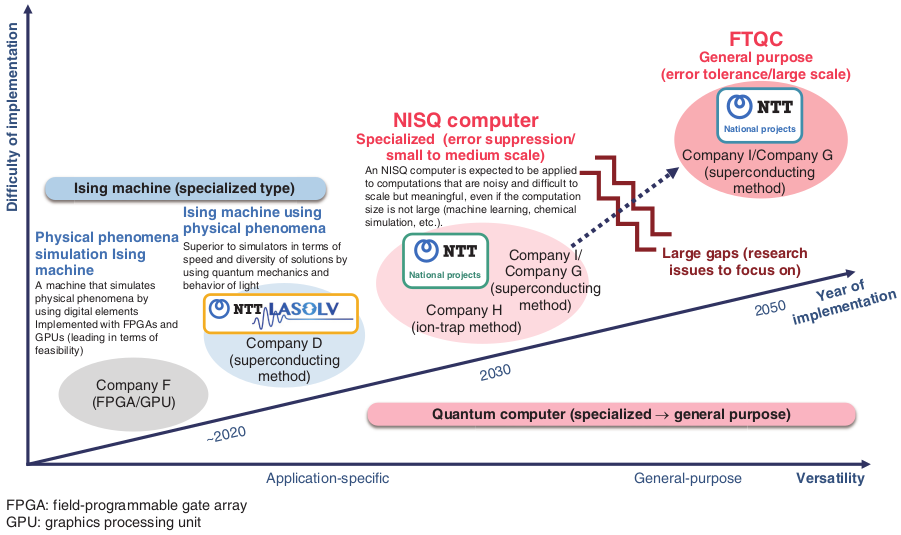

 

## S. Sakauchi, **_"Toward creation of a system architecture for quantum computers"_**, NTT Technical Review, vol. 21, no. 11, pp. 1-21, Nov. 2023.

### Quantum Security Course - _Paper Presentation_

David Araújo (93444)

<!-- footer: 25th of October 2024 -->

<!--
This paper discusses the development of quantum computers and their potential role in supporting the Innovative Optical and Wireless Network (IOWN) concept.
-->

---

<!-- paginate: true -->
<!-- header: __Toward creation of a system architecture for quantum computers__ | Quantum Security Course - _Paper Presentation_ -->
<!-- footer: ' ' -->

# Innovative Optical and Wireless Network

**Innovative Optical and Wireless Network** consists in the next-generation network and computing infrastructure concept

This will require a new computing infrastructure to support **Digital Twin Computing**, which requires processing huge amounts of data at unprecedented speeds

---

# Current State of Quantum Computing

<!--
-  Quantum computers using qubits
-  Ising machines for combinatorial optimization problems
-  Limited number of qubits
-  Error generation due to noise
-  Need for error correction
-->

Quantum computers use _qubits_ to solve complex problems **faster**, created with methods like **superconductivity**, **photons** and **ion trapping**.

**Ising machines** solve optimization problems using the Ising model and are already commercialized, though they have fewer applications.

_Qubit_ computers have more potential, but **Ising machines are more practical**.

<!--
NOTES
Number or qubits is currently limited. Current quantum computers lack scale and precision. Many companies and research institutes are developing multi-bit systems. A large-scale, fault-tolerant quantum computer (FTQC), capable of error correction during calculations like prime factorization, is not yet in practical use.

Ising machines specialize in solving combinatorial optimization problems that are time-consuming for classical computers. They use the Ising model, a statistical-mechanics model representing magnetic material properties. Unlike qubit-based quantum computers, Ising machines have limited applications but are already commercialized and lead in practical use.
-->

---

# NTT's Research Focus Areas

<!--
-  LASOLVTM computing system (Ising machine)
-  Optical quantum systems and superconducting systems
-  Error correction and suppression methods
-->

NTT is developing Ising machines, NISQ computers, and working toward fault-tolerant quantum computers (FTQCs).

The LASOLV™ Ising machine uses light for operations, with ongoing research into quantum computing hardware like optical and superconducting systems.

NTT is bridging the gap to FTQCs by researching "early-FTQC" technology, aiming to create practical computing infrastructure.

<!--
At NTT, they are advancing research in Ising machines and quantum computers, including NISQ computers and FTQCs.

They developed the LASOLV™ Ising machine, which uses light for operations, and are exploring its applications.

For quantum hardware, they are researching optical and superconducting systems. In software, their focus is on improving error correction and suppression for better performance.

Their goal is to bridge the gap from NISQ computers to FTQCs by developing "early-FTQC" technology and building practical computing infrastructure, as FTQCs can solve a broader range of problems but are more difficult to implement.
-->

---

# Challenges in Quantum Computing System Architecture

## Challenge 1: Difficulty in Application Development

Processing general problems with quantum computers requires complex algorithms to translate them into a form compatible with quantum systems.

<!--
Quantum computers require specialized algorithms, making it necessary to study how general problems can be translated into complex quantum algorithms suitable for these systems. The reliance on quantum mechanics creates a high barrier for general application developers.

To address this, efforts are focused on abstracting quantum hardware into libraries and SDKs, similar to how early classical computers evolved from assembly languages to higher-level tools. The goal is to develop instruction sets, intermediate representations, programming languages, and compilers that optimize processing for different types of quantum hardware.
-->

---

## Challenge 2: Limited Applicability

Quantum computers excel as accelerators for specific tasks but rely on seamless integration with classical systems to achieve their full potential. Designing hybrid systems that balance quantum and classical computing is key to maximizing efficiency and functionality

<!--
Quantum computers leverage superposition to process many inputs simultaneously, offering dramatic speed improvements for specific tasks like prime factorization. However, they are not fast enough to replace all classical computing operations. Instead, they function as accelerators. To maximize their advantage, it’s essential to design systems that integrate quantum and classical computing for optimal performance.
-->

---

## Challenge 3: Scalability Issues

To achieve useful quantum computation, increased scalability is essential. The current quantum computing hardware is still lacking the number of qubits required for meaningful operations, and the qubits that are available are highly susceptible to noise. Additional qubits are needed to correct errors and enable reliable operations.

<!--
Achieving practical quantum computation requires overcoming challenges related to scalability. Currently, quantum computers do not have enough qubits to perform meaningful operations, and those available are prone to noise. To address this, more qubits are needed to correct errors and ensure that operations can be executed reliably. This is a key step towards proving that quantum computers can outperform classical ones.
-->

---

# NTT's Approach to Address Challenges

## Addressing Challenge 1

We’re abstracting quantum hardware with libraries and SDKs to simplify development, enabling optimized processing across quantum and classical resources through instruction sets and compilers.

<!--
To make quantum computing more practical for developers, the paper outlines efforts to abstract quantum hardware components using libraries and SDKs, similar to how early classical computers used assembly languages. This approach will allow developers to focus on building applications without managing the complexity of quantum hardware. Additionally, the paper discusses the development of instruction sets, high-level programming languages, and compilers that enable optimized processing by combining the unique strengths of quantum and classical computing resources, improving overall efficiency.
-->

---

## Addressing Challenge 2

Integrating quantum and classical hardware is key. Quantum computers accelerate specific tasks, while classical computers offer versatility. Optimized distribution boosts computing power.

<!--
The development of distributed operating systems is key to leveraging the strengths of quantum and classical hardware. Quantum computers serve as accelerators for specialized tasks, while classical computers handle versatile operations. The challenge lies in creating system architectures that seamlessly combine the two, distributing processing efficiently. Research focuses on tightly integrating various quantum and classical systems, enabling optimized task allocation and unlocking the full potential of quantum computing in practical applications.
-->

---

## Addressing Challenge 3

Enhancing quantum hardware utility through software by integrating high-precision, high-speed, compact technologies with advanced error-suppression and correction methods.

<!--
The effectiveness of quantum hardware is significantly improved by combining it with advanced software solutions. Efforts focus on achieving high precision, faster processing, and compact integration. Additionally, robust error-suppression and correction theories are being developed to address the inherent noise and instability in quantum systems. This synergy between software and hardware aims to maximize the performance and reliability of quantum computing technologies.
-->

---

# Future Prospects and Conclusion

<!--
-  Potential for ultra-high-speed problem-solving
-  Ongoing development from Ising machines to NISQ and FTQCs
-->

Quantum computers offer ultra-fast solutions to problems beyond classical limits. NTT is developing architectures from Ising machines to NISQ computers and FTQCs.

<!--
Quantum computers offer unprecedented speed for solving complex problems beyond classical capabilities. NTT Computer and Data Science Laboratories is developing architectures that span practical Ising machines to NISQ and FTQC systems. While Ising machines are already closer to real-world application, further research is needed for the broader capabilities of NISQ and FTQCs. These efforts lay the groundwork for transformative quantum computing technologies.
-->

---

# Questions ?
