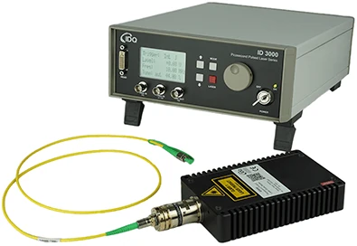

 

## Ali, S., Saharudin, S. & Wahiddin, M. R. (2009). **Quantum Key Distribution Using Decoy State Protocol**. American Journal of Engineering and Applied Sciences, 2(4), 694-698.

### Quantum Security Course - _Paper Presentation_

David Araújo (93444)

<!-- footer: 25th of October 2024 -->

<!--
- Experimental demonstration of decoy state quantum key distribution (QKD)

- Advantages of using decoy states to improve the security and performance of QKD systems, particularly in the presence of multi-photon pulses.

- By making simple modifications to a commercial QKD system, it is possible to achieve significantly higher key generation rates and longer distances.
-->

---

<!-- paginate: true -->
<!-- header: __Quantum Key Distribution Using Decoy State Protocol__ | Quantum Security Course - _Paper Presentation_-->
<!-- footer: ' ' -->

# Context and Background

Quantum Key Distribution (QKD) can help two remote parties to set up the secure key by **non-cloning theorem**.

In theory, this ensures that these **states cannot be perfectly copied**, providing a layer of security against eavesdroppers.

---

# Threats and Limitations

In a Photon-Number Splitting (PNS) attack, an eavesdropper (Eve) targets multi-photon pulses.

These can be split without disturbing the transmission, allowing Eve to intercept and retain one or more photons while letting the rest pass to Bob undetected.

---

# Motivation for Decoy States

Using decoy pulses that are **intentionally designed to have an intensity similar to single-photon states** but with slight variability.

The decoy states help detect and mitigate PNS attacks by **analyzing discrepancies in photon detection rates**, while the GLLP security proof **ensures that the overall system remains robust** against potential vulnerabilities in realistic settings.

---

# Key Generation Rate in QKD

Combining **signal states**, carrying most of the secret bits, with **weak and Vacuum states**, to detect eavesdropping, the improved QKD's key generation rate with high security is given by this formula.

Because BB84 is used, the subscript is:

$$ q = \frac{1}{2} \frac{N_2}{N} $$

$$ R \geq q \left\{ Q_\mu f(E_{mu}) H_2 (E_{mu}) + Q_1 [ 1 - H_2 (e_1) ] \right\} $$

$$ H_2(x) = -xlog_2(x) - (1-x)log_2(1-x) $$

---

# Real-life Implementation

Bob will send frames of **624 NP pulses with a 200 ns intervals**, ensuring that the entire frame returns before the next is sent.

<!--
This is done to avoid Rayleigh scattering - EXPLAIN!!
-->

Using **phase-shift keying (PSK)** the information is encoded in the phase difference between two pulses sent along different paths with varying delays and phase shifts.

<!-- The QKD system uses a phase-shift keying (PSK) technique, where information is encoded in the phase difference between two pulses. These pulses are initially identical but are separated into two paths: a short arm and a long arm. The long arm includes a phase modulator and a delay line, which introduces a controlled phase shift and time delay to one of the pulses.

Both pulses are then recombined at a 50/50 beam splitter (BS) and sent to Alice. The phase difference between the two pulses carries the encrypted key information. -->

In our implementation, the attenuation is done by placing a VOA (variable optical attenuator) in Alice’s side.

<!-- ID-3000 commercial quantum key distribution system -->

---

# Detection Mechanism

1. **Decoy Intensity Modulator (IM)**: Allows all incoming pulses to pass through without attenuation by default

2. **Frame Synchronization**: The first of a frame of a pulses sent from Bob, triggers the Decoy Generator.

3. **Pulse Attenuation**: After a delay, the Decoy Generator dynamically attenuates each pulse. Some to the intensity of signal states, others to the intensity of decoy states.

---

# Experimental Results

**Intensities chosen** for the signals and weak states:
_μ = 0.55, v = 0.152_

**Numbers of pulses used** as signal, weak decoy and vacuum states are:

$$ N_\mu = 0.645N ;\space N_v = 0.203N ;\space N_0 = 0.162N$$

**Total number of pulses sent**: 
_N = 105Mbit_

Both, the lower bound of the gain in signal states and upper bound of the error rate, in single photon states are given by:

<!--
After the transmission of all the N signals, Alice broadcasted to Bob the distribution of decoy states as well as basis information. Bob then announced which signals he had actually received in correct basis. We assume Alice and Bob announced the measurement outcomes of all decoy states as well as a subset of the signal states. From those experimental data, Alice and Bob then determined Qμ, Qv, Eμ and Ev, whose values are now listed in Table 1.
-->

---

# Comparative Analysis

The **gain** and **error rates** for a perfect single photon were calculated with a **10 standard deviations** for a conservative estimate.

Even so, a lower bound for the key generation rate per pulse is found, which means a final key length of about:

$$ L = NR = 66 kbit $$

<!--
The experimental results listed in Table 1 are the input for Eq. 1-4, whose output is a lower bound of the key generation rate, as shown in Table 2.
-->

$$ R^L= 6.2931*10^{-4} \approx \frac{R_{perfect}}{4}$$

<!--
Notice that, even with our very conservative estimation for a confidence of 1-1.5×10−23, the lower bound of R is still roughly 1/4 of R_perfect. This fact hints that it is not necessary, or rather, not “economical”, to use either very  large data size or a lot of different decoy states

We provide the experimental demonstration of decoy  state QKD over 25 km of Telecom fibers. Our result shows that,  with rather simple modifications (by adding commercial variable optical attenuators) to a commercial QKD system,  decoy state QKD allows us to achieve much better performance (in terms of substantially higher key generation rate and longer distance) than what is otherwise possible. 
-->

