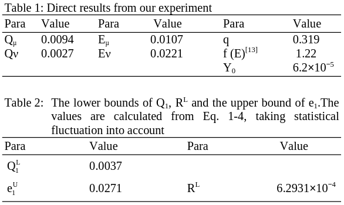

 

## Ali, S., Saharudin, S. & Wahiddin, M. R. (2009). **Quantum Key Distribution Using Decoy State Protocol**. American Journal of Engineering and Applied Sciences, 2(4), 694-698.

### Quantum Security Course - _Paper Presentation_

David Araújo (93444)

<!-- footer: 25th of October 2024 -->

<!--
- Experimental demonstration of decoy state quantum key distribution (QKD)

- Advantages of using decoy states to improve the security and performance of QKD systems, particularly in the presence of multi-photon pulses.

- By making simple modifications to a commercial QKD system, it is possible to achieve significantly higher key generation rates and longer distances.
-->

---

<!-- paginate: true -->
<!-- header: __Quantum Key Distribution Using Decoy State Protocol__ | Quantum Security Course - _Paper Presentation_-->
<!-- footer: ' ' -->

# Context and Background

Quantum Key Distribution (QKD) can help two remote parties to set up the secure key by **non-cloning theorem**.

In theory, this ensures that these **states cannot be perfectly copied**, providing a layer of security against eavesdroppers.

---

# Threats and Limitations

In a Photon-Number Splitting (PNS) attack, an eavesdropper (Eve) targets multi-photon pulses.

These can be split without disturbing the transmission, allowing Eve to intercept and retain one or more photons while letting the rest pass to Bob undetected.

---

# Motivation for Decoy States

Using decoy pulses that are **intentionally designed to have an intensity similar to single-photon states** but with slight variability.

The decoy states help detect and mitigate PNS attacks by **analyzing discrepancies in photon detection rates**, while the GLLP security proof **ensures that the overall system remains robust** against potential vulnerabilities in realistic settings.

---

# Key Generation Rate in QKD

How efficiently does a QKD system produces secure keys?

Combining **signal states**, carrying most of the secret bits, with **weak and Vacuum states**, to detect eavesdropping, improves QKD's key generation rate while maintaining high security.

$$R \geq q \left\{ Q_\mu f(E_{mu}) H_2 (E_{mu}) + Q_1 [ 1 - H_2 (e_1) ] \right\} $$

---

# Real-life Implementation

The prototype QKD system involves Bob sending frames of **624 NP pulses with a 200 ns interval between each pulse**, ensuring that the entire frame returns to Bob before the next is sent to avoid Rayleigh scattering.

The QKD system uses phase-shift keying (PSK) to encode information in the phase difference between two pulses sent along different paths with varying delays and phase shifts.

<!-- The QKD system uses a phase-shift keying (PSK) technique, where information is encoded in the phase difference between two pulses. These pulses are initially identical but are separated into two paths: a short arm and a long arm. The long arm includes a phase modulator and a delay line, which introduces a controlled phase shift and time delay to one of the pulses.

Both pulses are then recombined at a 50/50 beam splitter (BS) and sent to Alice. The phase difference between the two pulses carries the encrypted key information. -->

---

# Detection Mechanism

1. **Decoy Intensity Modulator (IM)**: Allows all incoming pulses to pass through without attenuation by default

2. **Frame Synchronization**: The first of a frame of a pulses sent from Bob, triggers the Decoy Generator.

3. **Pulse Attenuation**: After a delay, the Decoy Generator dynamically attenuates each pulse. Some to the intensity of signal states, others to the intensity of decoy states.

---

# Results

**Intensities chosen** for the signals and weak states: _μ = 0.55, v = 0.152_

**Numbers of pulses used** as signal, weak decoy and vacuum state are:

$$ N_\mu = 0.645N$$
$$ N_v = 0.203N$$
$$ N_0 = 0.162N$$

Total number of pulses sent _N = 105Mbit_

---

# Comparative Analysis

