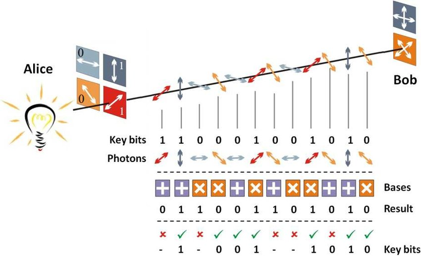
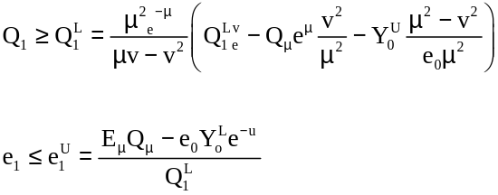
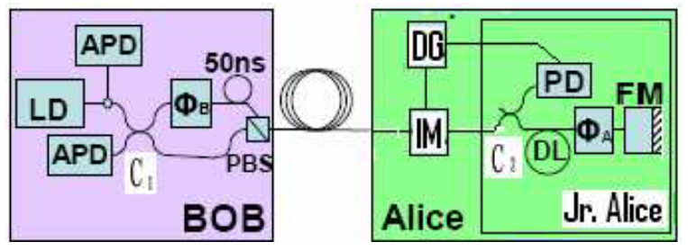
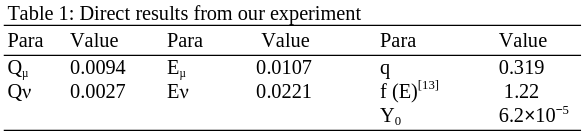
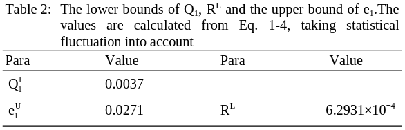

 

## Ali, S., Saharudin, S. & Wahiddin, M. R. (2009). **Quantum Key Distribution Using Decoy State Protocol**. American Journal of Engineering and Applied Sciences, 2(4), 694-698.

### Quantum Security Course - _Paper Presentation_

David Araújo (93444)

<!-- footer: 25th of October 2024 -->

<!--
- Experimental demonstration of decoy state quantum key distribution (QKD)

- Advantages of using decoy states to improve the security and performance of QKD systems, particularly in the presence of multi-photon pulses.

- By making simple modifications to a commercial QKD system, it is possible to achieve significantly higher key generation rates and longer distances.
-->

---

<!-- paginate: true -->
<!-- header: __Quantum Key Distribution Using Decoy State Protocol__ | Quantum Security Course - _Paper Presentation_-->
<!-- footer: ' ' -->

# Context and Background

Quantum Key Distribution (QKD) can help two remote parties to set up the secure key by **non-cloning theorem**.

In theory, this ensures that these **states cannot be perfectly copied**, providing a layer of security against eavesdroppers.

---

# Threats and Limitations

In a Photon-Number Splitting (PNS) attack, an eavesdropper (Eve) targets multi-photon pulses.

These can be split without disturbing the transmission, allowing Eve to intercept and retain one or more photons while letting the rest pass to Bob undetected.

---

# Motivation for Decoy States

These are pulses that are **intentionally designed to have an intensity similar to single-photon states** but with slight variability.

**Signal states** will carry most of the secret bits, while **weak and Vacuum states** are for detecting eavesdropping.

The decoy states help detect and mitigate PNS attacks by **analyzing discrepancies in photon detection rates**, while the GLLP security proof **ensures that the overall system remains robust** against potential vulnerabilities in realistic settings.

---

# Key Generation Rate in QKD

The improved QKD's key generation rate with high security is given by this formula:

$$ R \geq q \left\{ Q*\mu f(E*{mu}) H*2 (E*{mu}) + Q_1 [ 1 - H_2 (e_1) ] \right\} $$

The **gain of the weak decoy state** and its **error rate** will result directly from experiments. Bounds for the **gain** and **error rate** of single photon states are given by:

---

# Real-life Implementation

Bob will send frames of **624 NP pulses with a 200 ns intervals**, ensuring that the entire frame returns before the next is sent.

<!--
This is done to avoid Rayleigh scattering - This is the scattering of photons by particles in the transmission medium, such as air molecules or optical fiber impurities. This scattering causes photons to deviate from their original path, leading to signal loss and the introduction of noise. The effects of Rayleigh scattering include reduced transmission efficiency, increased error rates, and potential security vulnerabilities due to the introduction of additional noise that could be exploited by eavesdroppers.
-->

The **key is encoded** (using _PSK_) **in the phase between two pulses** traveling from Bob to Alice and back, emitted at Bob and separated at a first 50/50 Beam Splitter, having traveled through a shot and long arm, including a _Phase Modulator (PMb)_ and a 50ns _Delay Line (DL)_ respectively.

<!--
Phase-shift keying (PSK) is a digital modulation technique that conveys data by changing the phase of a constant frequency carrier wave. Different phase shifts represent different digital symbols, allowing for the transmission of information.
-->

---

# Decoy Modulation

1. **Decoy Intensity Modulator (IM)**: By default, all pulses pass through without attenuation. After the first pulse reaches coupler C2, a **synchronization signal will be output**.

2. **Frame Synchronization**: When the Decoy Generator is triggered, it will **hold for a delay time** before outputting a modulation voltage.

3. **Pulse Attenuation**: The Decoy IM will attenuate the intensity of each of the signals to that of the signal state of decoy state, dynamically.

---

# Experimental Results

**Intensities chosen** for the signals and weak states:
$$ \mu = 0.55; \space v = 0.152 $$

**Numbers of pulses used** as signal, weak decoy and vacuum states are:

$$ N\_\mu = 0.645N ;\space N_v = 0.203N ;\space N_0 = 0.162N$$

**Total number of pulses sent** by Alice:
$$ N = 105Mbit $$

After the transmission of all _N_ signals:

1. Alice broadcasts to Bob the distribution of decoy states.

2. Bob then announces which signal he received in correct basis

3. Both will calculate the gains and error rates of signal and decoy states.

---

# Comparative Analysis

<!--
The experimental results listed in Table 1 are the input for Eq. 1-4, whose output is a lower bound of the key generation rate, as shown in Table 2.
-->

$$ R^L= 6.2931\*10^{-4} $$

$$ L = NR $$

A final key length of _66 kbit_ is found.

Even with a conservative estimation for a confidence within 10 standard deviations:

$$ R^L \approx \frac{R\_{perfect}}{4} $$

This hints that **small data sizes** and **few decoy states** are sufficient!

<!--
Notice that, even with our very conservative estimation for a confidence of 1-1.5×10−23, the lower bound of R is still roughly 1/4 of R_perfect. This fact hints that it is not necessary, or rather, not “economical”, to use either very large data size or a lot of different decoy states

We provide the experimental demonstration of decoy state QKD over 25 km of Telecom fibers. Our result shows that, with rather simple modifications (by adding commercial variable optical attenuators) to a commercial QKD system, decoy state QKD allows us to achieve much better performance (in terms of substantially higher key generation rate and longer distance) than what is otherwise possible.
-->

---

# Conclusion

For this set-up, at a distance of 25 km, without decoy states, it **wouldn't be possible to prove the security** of this protocol in an analogous manner.

With simple modifications to commercial QKD systems, decoy QKD allows **high key rate generation with unconditional security** against PNS attacks.

---

# Questions ?

<!--
1. Question: How does the introduction of decoy states impact the overall key generation rate in QKD systems?

Response: The use of decoy states helps improve the key generation rate by allowing Alice and Bob to better estimate the channel characteristics and detect potential eavesdropping more accurately. By comparing the gains and error rates of signal and decoy states, they can securely maximize the use of single-photon transmissions, leading to a more efficient and higher secure key rate. This ensures that even in practical conditions with channel losses, a substantial key rate can still be achieved​

2. Question: What are the main limitations observed in the implementation of the decoy state protocol in your experiment?

Response: The main limitations include the finite data size and the necessity for precise calibration of sources and detectors. In the experiment, while the weak + vacuum protocol significantly improved key generation rate and distance, statistical fluctuations due to limited data size reduced the key rate below the theoretical maximum. Additionally, ensuring that the variable optical attenuator (VOA) accurately attenuates signals without compromising polarization is crucial, as any artifact or misalignment can impact security​
-->
